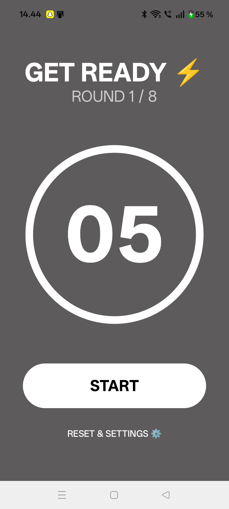
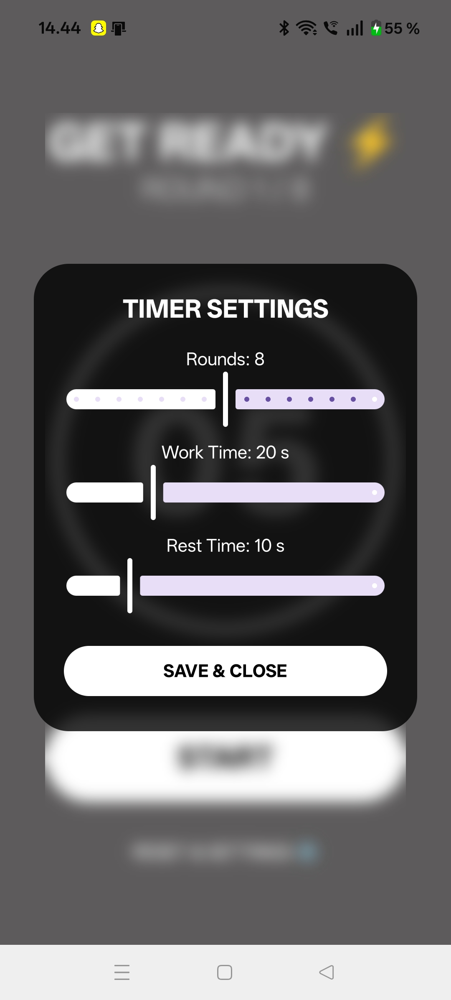
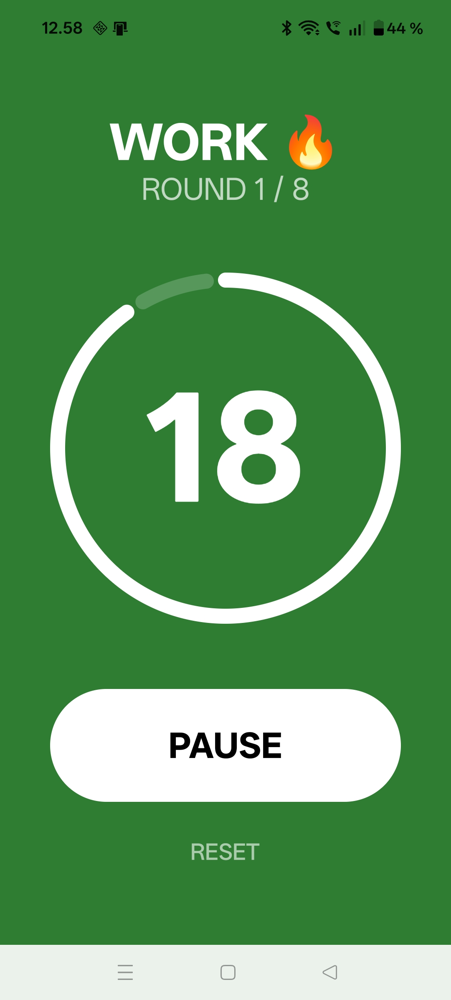
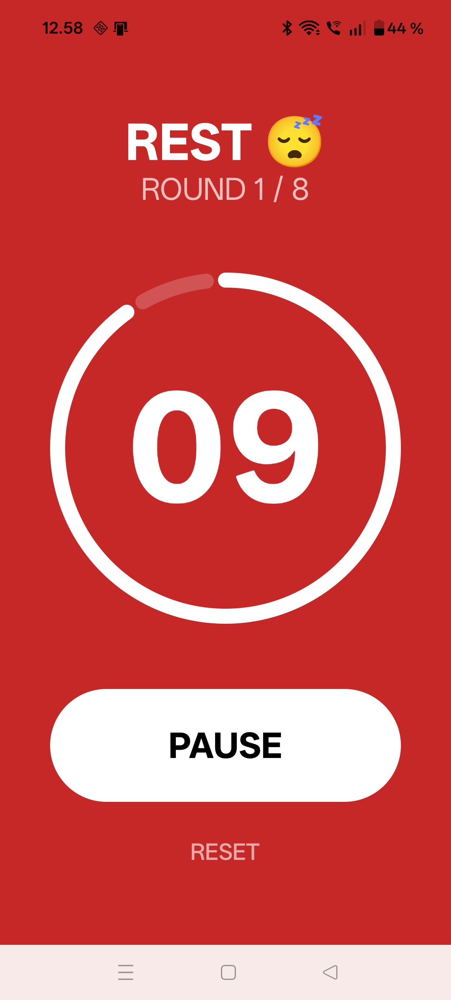
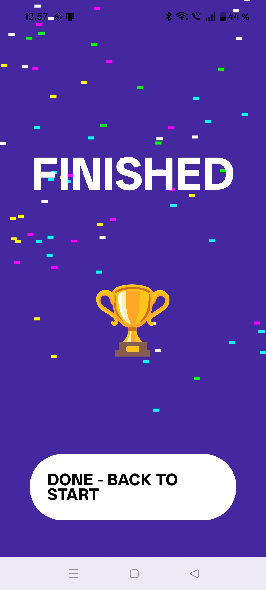

# Tabata Timer & Fitness App 🏃‍♂️💨

Moderni Android-sovellus korkeatehoiseen kuntoiluun.
Kehitin sovelluksen omaan käyttööni tarpeesta saada kustomoitu ja
visuaalisesti miellyttävä treeniajastin hyvällä klassisella muusikilla. Projektin toteutuksessa on hyödynnetty tekoälyavusteista
ohjelmointia logiikan optimoinnissa ja ongelmanratkaisussa.

## ✨ Näyttökuvat sovelluksesta

  
  
    
  
  

## ✨ Ominaisuudet

- **Reaktiivinen UI:** Toteutettu kokonaan Jetpack Composella.
- **Dynaamiset animaatiot:** Kustomoidut Canvas-pohjaiset edistymispalkit ja konfettiefektit.
- **Audio-integraatio:** Synkronoitu ääniohjaus harjoituksen eri vaiheisiin.

## 🛠 Teknologiat
- **Kieli:** Kotlin
- **UI-framework:** Jetpack Compose
- **Arkkitehtuuri:** MVVM (Model-View-ViewModel)

## 🚀 Asennus
1. Kloonaa repo: `git clone https://github.com/matiasgrahn/Tabata-Timer-Android`
2. Avaa projekti Android Studiolla.